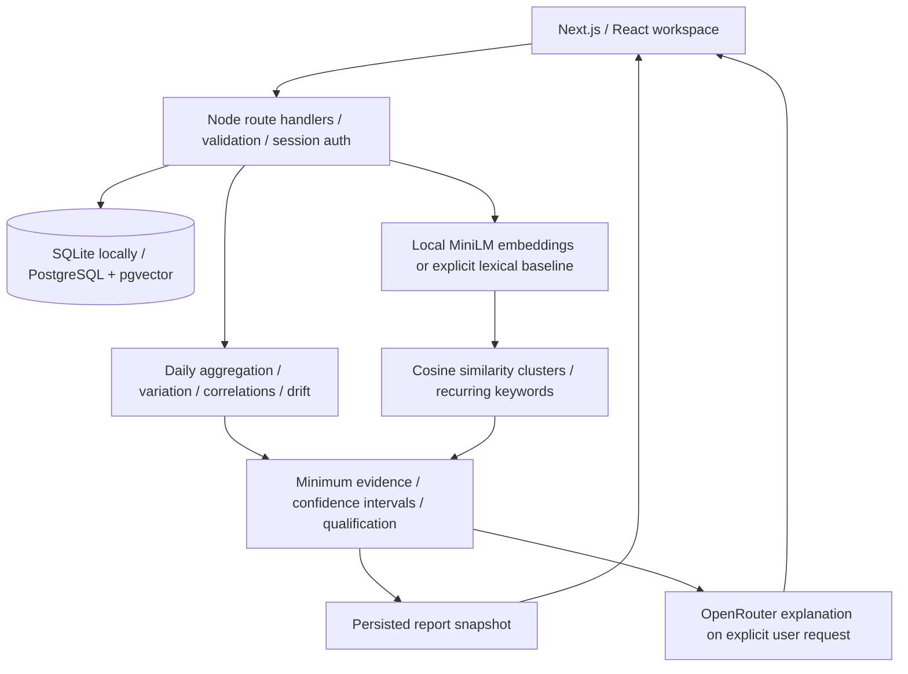
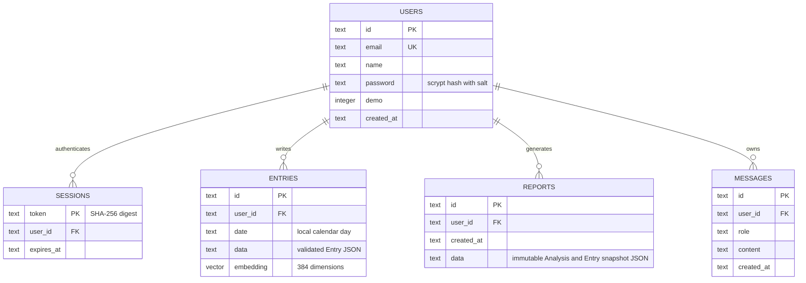

# Mental Health Wellness architecture

The AI Mental Health Awareness Companion implements the supplied BTech synopsis: structured reflections, longitudinal statistics, narrative clusters, and user-triggered awareness reports. It does not diagnose conditions or provide treatment. OpenRouter replaces the proposed OpenAI API. The UI product name is Still, with Mental Health Wellness as the repository and project name.

## Design direction

Visual thesis: warm paper surfaces, forest green accents, editorial typography, and a calm workspace organized around the user's actual records.

Content plan: overview with check-in and longitudinal chart; journal with structured and narrative input; patterns with qualified evidence; reports with saved snapshots; companion with optional AI interpretation; account and privacy settings.

Interaction thesis: staggered workspace entrance, deliberate tab/selection feedback, and a paced breathing interaction. Honor reduced motion. Use a quiet forest photograph as secondary atmosphere, not as a barrier to the working surface.

## System boundaries

## Technology choices

- Next.js App Router, TypeScript, React, Recharts and CSS: frontend and same-origin API in one deployable Node application. Next route handlers replace a redundant standalone Express server.
- PostgreSQL with pgvector is the deployment database. Docker Compose supplies a local PostgreSQL service. SQLite is an embedded persistent alternative for an immediate college demonstration. No browser localStorage is used for journals.
- Passwords use scrypt with random salts. Opaque session tokens are SHA-256 hashed in the database; cookies are HttpOnly and SameSite=Lax. Every record query is scoped to its authenticated owner. Mutations check browser origin. Login and AI calls have bounded request rates. Demo mode creates a separate temporary account and clearly marked synthetic records.
- AI calls use server-side fetch to OpenRouter's chat completions endpoint. The default is `openrouter/free`; free-model availability and rate limits belong to OpenRouter. There is no OpenAI SDK, OpenAI endpoint, or automatic paid-model fallback.
- Semantic embeddings run locally with `Xenova/all-MiniLM-L6-v2` through Transformers.js, 384 dimensions, mean pooling and L2 normalization. This requires a one-time model download. An explicitly labeled 384-dimensional hashed word/bigram vector baseline is provided for offline setup; its clusters capture lexical similarity, not semantic understanding. Vector methods are never mixed within a report.

## Storage

`users` owns `sessions`, `entries`, `reports`, and `messages`. Entries store local calendar date, stress, energy, clarity, valence (1–10), sleep hours, workload (1–10), activity minutes, contextual tags, narrative, vector, and embedding method. PostgreSQL uses a native `vector(384)` column; SQLite stores the vector as JSON. Reports persist their analysis and entry snapshot so later journal edits do not silently rewrite a report. Exports return the user's records and reports; account deletion cascades across owned rows.

## Analysis methodology

Multiple entries on one date are averaged before time-series analysis so frequent journaling does not overweight a day. Missing dates are not imputed. Means and sample standard deviations describe each metric; volatility uses RMSSD only across consecutive observed calendar days. Seven-day drift compares two complete seven-day windows, requiring at least five observed days in each. Pearson correlations require at least 14 paired days, nonzero variance, absolute r >= 0.4, and a Fisher-z 99% confidence interval excluding zero (a conservative correction for four predeclared comparisons). No causality or calibrated clinical confidence is claimed; serial correlation and self-report bias remain limitations. Narrative groups require at least three entries on three different dates. Cosine thresholds are heuristic and method-specific, not probabilities. The UI exposes withheld evidence and sample sizes.

## API surface

`POST /api/auth/register`, `/login`, `/demo`, `/logout`; `GET /api/me`; `GET/POST /api/entries`; `PATCH/DELETE /api/entries/:id`; `GET /api/analytics?days=30`; `GET/POST /api/reports`; `GET/POST /api/companion`; `GET /api/export`; `DELETE /api/account`; `GET /api/health`.

AI requests share the user's question plus aggregate statistics and qualified numerical findings. Raw journals and narrative keywords are excluded. Consent is explicit in the companion view; missing configuration and provider failures are surfaced without invented AI output. The assistant is constrained to explain the supplied statistics, distinguish association from causation, avoid diagnosis, and acknowledge insufficient evidence.

## Verification and deployment boundary

Run the calculation/qualification tests and API integration tests, TypeScript checks, and production build. Browser checks cover registration/demo, journal persistence, report generation, account isolation, and responsive navigation. Before internet deployment configure HTTPS, secure cookies, PostgreSQL credentials, protected database backups, and an external rate limiter for multiple replicas. The included in-process rate limiter is suited to a single server. This is an academic awareness application, not a validated clinical device.

## Reference contracts

- Synopsis.dox.docx, supplied by the user: functional scope and architecture requirements.
- https://openrouter.ai/docs/quickstart — server API contract.
- https://openrouter.ai/docs/guides/routing/routers/free-router — free-router model selection.
- https://github.com/pgvector/pgvector — PostgreSQL vector type.
- https://huggingface.co/Xenova/all-MiniLM-L6-v2 — local embedding model.
