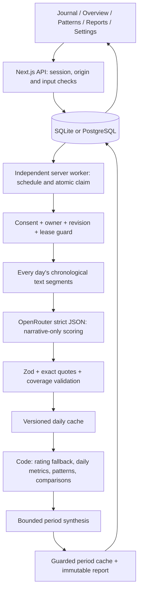

# Journal-first architecture

Still is the interface for Mental Health Wellness. This revision replaces the earlier self-report-statistics/Companion workflow. The supplied journal-first specification takes precedence over earlier synopsis assumptions. OpenRouter is the only active external inference integration.

## System boundaries

The browser never gets the provider key and never starts inference during a GET/render. Saving journals does not wait on AI or local embeddings. A separate Node worker executes the pipeline even with every browser closed.

## Source and cache normalization

- Existing date-only strings remain their original calendar dates. A saved IANA timezone (default UTC) controls new-entry dates and schedule boundaries, not retrospective date shifting.
- A day includes every entry on that date, sorted by date, creation timestamp and ID tie-breaker.
- Blank-line paragraphs are retained as source units; long paragraphs are split into bounded 3,000-character segments with entry/date/paragraph/segment identifiers. No recent-only slice or silent text truncation is used.
- Initial text requests contain up to 12,000 serialized characters per batch. All chunk outputs are merged hierarchically. Complete subtree IDs provide verifiable coverage at each level. Period inputs contain every daily summary, final metrics, all validated chunk observations and semantic events, and deterministic pattern statistics.
- Period atoms are batched at 30,000 characters; merge batches are bounded at 60,000. Oversized/non-reducing output fails explicitly rather than dropping later entries. Provider context/output limits can still prevent a very large history from completing.
- Daily hashes include the complete ordered input records, timezone and analysis version. Separate form ratings are included in cache invalidation but excluded from narrative scoring requests.
- Day caches are user/date-scoped and content-hash checked. Edits/moves delete old/new daily caches; all period snapshots become stale through the owner's revision counter. Journal deletion also removes affected live period caches. Immutable successful reports are unchanged.
- Already-requested pending ranges are requeued at the new revision when a journal changes; old worker tokens are fenced. Permission changes cancel pending jobs instead of silently opting them back in.

## Scoring contract

All eight dimensions are subjective, unvalidated estimates on a 1–10 scale. Anchors are a rubric, not psychometric calibration:

| Dimension                | 1                 | 5                           | 10                      |
| ------------------------ | ----------------- | --------------------------- | ----------------------- |
| Emotional tone / valence | Very unpleasant   | Explicitly mixed or neutral | Very pleasant           |
| Stress                   | Little pressure   | Some pressure               | Overwhelming pressure   |
| Energy                   | Exhausted         | Workable energy             | Highly energized        |
| Clarity                  | Confused          | Partly clear                | Very clear              |
| Social connection        | Isolated          | Some connection             | Deeply connected        |
| Motivation               | Little drive      | Some drive                  | Strong drive            |
| Calmness                 | Agitated          | Partly settled              | Deeply settled          |
| Self-compassion          | Harsh toward self | Mixed                       | Deeply kind toward self |

The first inference stage cannot see separate numeric form fields. For each day/dimension:

1. Adequate narrative evidence: use the AI estimate, exact evidence and qualitative strength.
2. Insufficient narrative evidence: use the mean of only explicitly supplied ratings for that day/dimension, if any.
3. Neither: null.

A provider error is not insufficient narrative evidence and never creates an AI-looking fallback analysis. Empty text can be classified as insufficient without a provider call. Original per-entry form values remain in `explicitEntries`; the daily explicit mean remains alongside the AI estimate. A difference of at least three points produces a neutral discrepancy note, not a claim that either value is correct.

Each result retains value/null, source, scale/direction, strength, explanation, evidence, entry/rating coverage, original explicit mean and discrepancy. Strength means support in the text, not probability. Factual sleep hours/activity minutes come only from explicit numeric form input; no tone-based inference.

## Aggregation and comparison

- Day-level overall: arithmetic mean of available dimensions with stress transformed to `11 - stress`, requiring at least four dimensions. Contributors are retained.
- Period-level overall: take days meeting that threshold, intersect their available dimensions, and require at least four common dimensions. Recompute each eligible day on that fixed set, then average days equally. A changing contributor mix is not silently compared.
- Overall is labeled unvalidated AI-estimated wellbeing, or self-report fallback wellbeing when no contributor is AI-derived.
- Per-dimension period summaries average usable observed days; expose AI, fallback, missing and usable day counts. Missing calendar days remain unknown, never zero or neutral.
- Previous-range comparison uses already-valid daily caches from the immediately preceding equal-length calendar window. It requires at least three eligible days per period and four common dimensions across both sets. It is withheld otherwise; the worker does not secretly analyze an unrequested earlier range.
- Differing coverage and serial dependence remain limitations. No significance, clinical probability or efficacy claim is made.

## Semantic patterns

The model extracts evidence-linked activities, people/explicit roles, stressors, contexts, language/thought patterns, helpful experiences and strengths. It distinguishes experienced, planned, negated, quoted, hypothetical and historical content. Conservative canonical labels plus a small documented alias map group synonyms such as stroll/walking. Generic or ambiguous people are occurrence-scoped, not merged into an invented identity.

Code, not model prose, computes distinct dates, recurrence and comparisons. Single mention means one date, emerging means two, recurring requires three. Multiple same-day mentions never increase day count. All event details/evidence remain available, including differing experiences.

Activity associations compare emotional-tone means on experienced activity-mentioned versus not-mentioned days, requiring three usable dates in **each** group. Non-mention does not mean absence. This is not causation, a mood boost, independent validation or a treatment recommendation; both exposure and estimate may originate from the same text. Before/after interpretations require explicit textual support in the prompt rubric.

## AI validation and limits

`provider.ts` requires a free model name, zero-price routing and structured-output-capable endpoints via `provider.require_parameters`. Every response is Zod-validated. Unknown keys, malformed JSON, incomplete generation, missing model metadata, unsupported metric provenance, missing coverage and inexact source/date/quote references are rejected. Numerical prose is constrained and checked; displayed counts, averages and differences are code-computed. Semantic correctness is still not guaranteed by schema or exact-quote matching.

Journal material is serialized in a separate untrusted user-data message; the system prompt is fixed/versioned. There are no tools. Provider calls have 90-second timeouts and at most three attempts with exponential delay. Unsupported structured routes/authentication errors stop immediately. Consent/ownership/revision/token are checked before every call/retry, after calls and before each write. Model metadata retains requested/returned model, input hash, timestamp and prompt/schema version.

Satori's warm, specific, non-generic and tentative reflection principles are adapted in the prompts. Source references, exact revision, modifications and Apache 2.0 license are retained in the third-party notice. Clinical formulation, hidden personality modeling, trauma/attachment inference and spiritual assumptions are excluded. Immediate-danger output requires evidence and a support message; historical/quoted/negated content is distinguished in instructions. This is not a validated risk detector or a monitored crisis service.

## Storage and migrations

`lib/db.ts` creates additive tables/indexes and records `2026-09-journal-v1` in `schema_migrations`. Existing JSON records are not rewritten. SQLite uses WAL, foreign keys, a busy timeout and serialized transaction access. PostgreSQL uses a checked-out client for transactions.

| Table               | Purpose                                                                       |
| ------------------- | ----------------------------------------------------------------------------- |
| users / sessions    | Existing account and hashed session data                                      |
| entries             | Existing journal JSON; optional numeric fields remain nullable                |
| messages            | Historical Companion messages, exportable but no active endpoint              |
| reports             | Immutable new journal-AI or legacy snapshots                                  |
| journal_preferences | Timezone, versioned consent, separate automatic permissions, revision         |
| journal_daily       | Latest owner/date cache, hash, complete normalized evidence and metadata      |
| journal_periods     | Owner/range cache, revision and derived dataset                               |
| journal_jobs        | Durable status, progress/error, attempts, lease/token, dedupe keys, result ID |
| journal_worker_lock | Global lease limiting concurrent processing                                   |
| schema_migrations   | Additive migration version record                                             |

Foreign keys cascade on account deletion. Report deletion removes that snapshot, not independent reports or the journal. Journal deletion retains copies already saved in immutable reports, explicitly disclosed in the UI. Full export includes all jobs (not only the recent UI list), preferences, caches, reports, original entries and historical messages. Backups and third-party retained data need their own retention policy.

## API

| Method / route                               | Behavior                                              |
| -------------------------------------------- | ----------------------------------------------------- |
| POST /api/auth/register, login, demo, logout | Existing account/session flow                         |
| GET /api/me                                  | User, configuration flags and preferences; no API key |
| GET/POST /api/entries                        | List or atomically save/queue journal                 |
| PATCH/DELETE /api/entries/:id                | Owner-scoped edit/delete and invalidation             |
| GET/PATCH /api/preferences                   | Validate timezone and new consent permissions         |
| GET /api/analytics?start=…&end=…             | Cached status/dataset only                            |
| POST /api/analysis                           | Queue a selected overview range                       |
| GET /api/jobs                                | Recent owner-scoped progress                          |
| POST /api/jobs/:id/retry                     | Retry failed/cancelled authorized work                |
| GET/POST /api/reports                        | List snapshots / queue a new report revision          |
| DELETE /api/reports/:id                      | Explicit snapshot deletion and late-write fencing     |
| /api/companion                               | HTTP 410; no active chatbot                           |
| GET /api/export                              | Complete owner-scoped export                          |
| DELETE /api/account                          | Confirmed cascading deletion                          |
| GET /api/health                              | Database connectivity                                 |

Security retains scrypt passwords, hashed opaque sessions, HttpOnly/SameSite cookies, origin checks and per-process request limiting. Production needs HTTPS, disk/database access protection, shared web rate limiting, review of provider policies and a formal security assessment. PostgreSQL deployment remains unverified locally.
